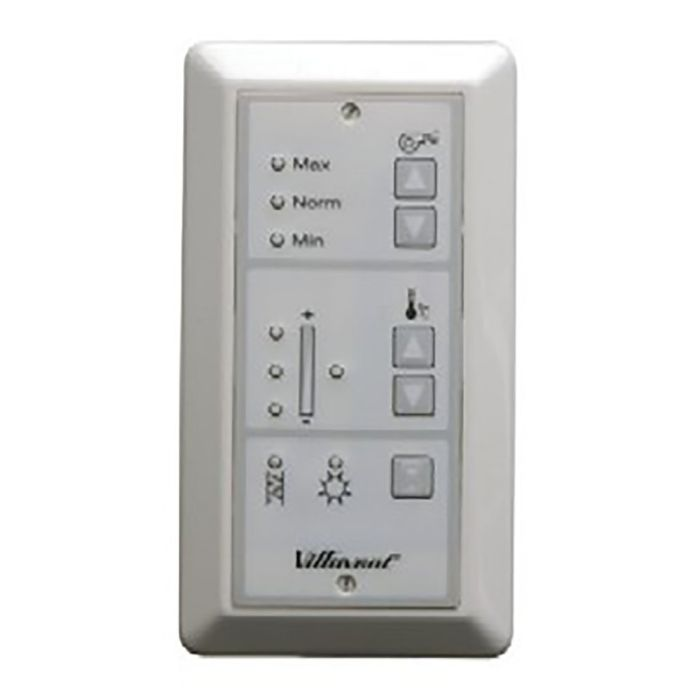
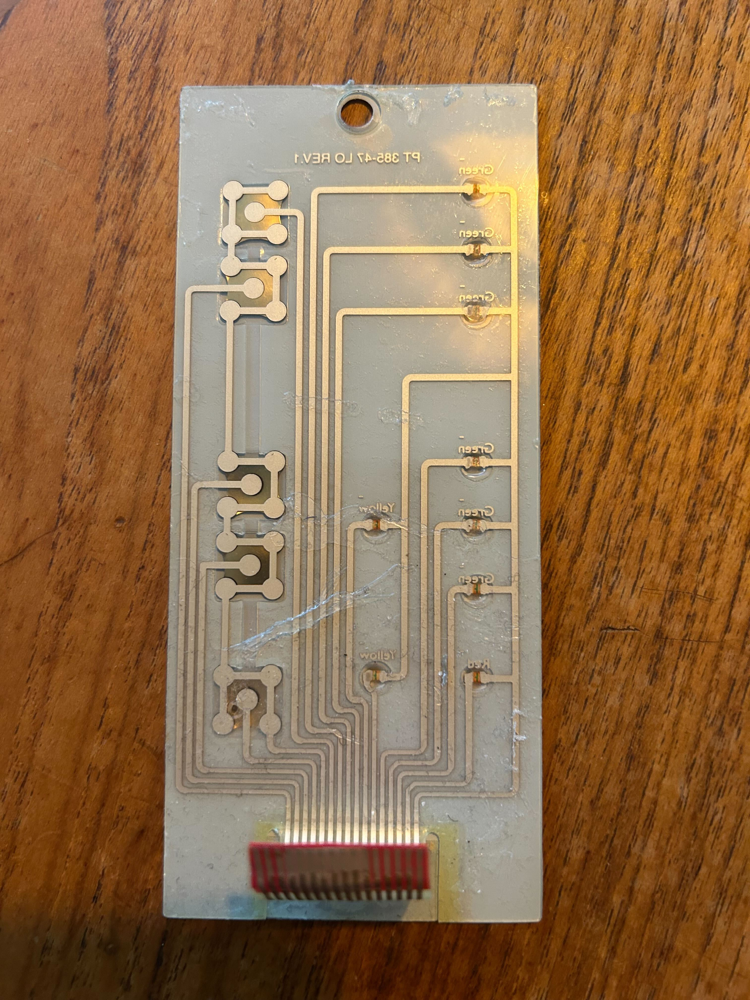
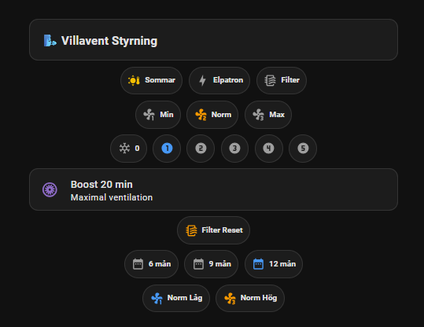

# Villavent VR 400/E3 — ESPHome Control via ESP32

<p align="center">
  
</p>

Control your Villavent VR 400/E3 ventilation unit using an ESP32 and ESPHome, integrated with Home Assistant. Instead of modifying the original electronics, this project uses **optocouplers** to simulate button presses and read LED status indicators — keeping the original control board fully intact.

## Background

This project started when the original wall panel stopped responding entirely. The culprit was the FFC (flat flexible cable) connector: it had worked loose from the panel PCB. The back of the board (below) shows the connector at the bottom edge and the traces running up to each button and LED.

<p align="center">
  
</p>

Rather than waiting for a replacement part, I re-soldered directly to the FFC connector pads on the back of the PCB. With the cable firmly re-attached and the panel working again, it was a natural step to add ESP32-based smart control at the same time — tapping into the same signals with optocouplers to keep the original board completely unmodified.

## How It Works

The Villavent VR 400/E3 has a physical wall-mounted control panel with:
- **Fan speed buttons** (▲/▼) and indicator LEDs for Max / Norm / Min
- **Temperature buttons** (▲/▼) and a 3-LED bar showing the current setpoint (levels 0–5)
- A **Summer mode** indicator and a **Filter change** alert LED

This project taps into those signals using optocouplers in two ways:

**Outputs (simulating button presses):** An optocoupler is connected in parallel with each button. When the ESP32 briefly pulls the GPIO high (300 ms pulse), the optocoupler closes the circuit — identical to a physical button press.

**Inputs (reading LED state):** An optocoupler is connected across each status LED. When the LED lights up, it drives the optocoupler which pulls the ESP32 GPIO low (inputs are configured with pull-up + inverted).

This approach means zero direct electrical connection between the ESP32 and the ventilation unit's PCB.

## Features

- Fan speed control (UP / DOWN) with current state feedback (MIN / NORMAL / MAX)
- Temperature setpoint control (UP / DOWN) with current state feedback (levels 0–5)
- Filter interval presets (6 / 9 / 12 months) — auto-navigates to the target and confirms
- 20-minute boost mode at MAX fan with live countdown, cancellable from dashboard
- Status sensors: Electric heater active, Summer mode, Filter change alert
- Full Home Assistant integration via ESPHome API
- OTA firmware updates

## Wiring Schematic

Two different optocoupler circuits are used. A PC817 (or equivalent 4N35) works for both.

### Output — Button Simulation (×5) — 220 Ω

```
                      ┌─────────────────────┐
ESP32 GPIO ─[220Ω]──▶ 1 (A)             3 (C) ──── FFC button signal pin
                      │      PC817          │
ESP32 GND  ─────────▶ 2 (K)             4 (E) ──── FFC GND (pin 5)
                      └─────────────────────┘
```

When the ESP32 GPIO goes HIGH, current flows through the 220 Ω resistor and the optocoupler's LED, switching the transistor on and closing the circuit across the button contacts.

### Input — LED Reading (×9) — 1.2 kΩ

```
                         ┌─────────────────────┐
FFC VCC (16) ─[1.2kΩ]──▶ 1 (A)             3 (C) ──── ESP32 GPIO (input, pull-up)
                         │      PC817          │
FFC LED signal ─────────▶ 2 (K)             4 (E) ──── ESP32 GND
                         └─────────────────────┘
```

When the panel LED is on, current flows from FFC VCC through the 1.2 kΩ resistor and the optocoupler's LED, switching the transistor on and pulling the ESP32 GPIO low. The GPIO is configured as `input: pullup, inverted: true`, so it reads `true` (on) when the LED is lit.

## FFC Connector Pinout

The control panel connects to the main unit via a 16-pin FFC (flat flexible cable). This is where you tap in with optocouplers.

| FFC Pin | Signal              | Type   | Notes                        |
|---------|---------------------|--------|------------------------------|
| 1       | Fan DOWN            | Button |                              |
| 2       | Temp UP             | Button |                              |
| 3       | Temp DOWN           | Button |                              |
| 4       | Timer (Tidur)       | Button | Used for filter interval & reset |
| 5       | Common (GND)        | Button | Shared return for all buttons |
| 6       | Fan UP              | Button |                              |
| 7       | Fan LED — MAX       | LED    |                              |
| 8       | Fan LED — NORMAL    | LED    |                              |
| 9       | Fan LED — MIN       | LED    |                              |
| 10      | Electric heater LED | LED    |                              |
| 11      | Summer mode LED     | LED    |                              |
| 12      | Temp level 3 LED    | LED    | = Lamp 8 in ESPHome          |
| 13      | Temp level 2 LED    | LED    | = Lamp 7 in ESPHome          |
| 14      | Temp level 1 LED    | LED    | = Lamp 6 in ESPHome          |
| 15      | Filter change LED   | LED    |                              |
| 16      | VCC for LEDs        | Power  | LED supply voltage           |

For **button outputs**: connect the optocoupler output (collector/emitter) between the FFC pin and pin 5 (common).  
For **LED inputs**: connect the optocoupler LED side between FFC pin 16 (VCC) and the FFC signal pin, with a current-limiting resistor in series from VCC.

## Pin Mapping

### Outputs — Button Simulation (ESP32-S3 → FFC)

| Function  | GPIO | FFC Pin |
|-----------|------|---------|
| Fan UP    | 2    | 6       |
| Fan DOWN  | 1    | 1       |
| Temp UP   | 6    | 2       |
| Temp DOWN | 5    | 3       |
| Tidur     | 3    | 4       |

### Inputs — LED Reading (FFC → ESP32-S3)

| Function              | GPIO | FFC Pin | Notes                               |
|-----------------------|------|---------|-------------------------------------|
| Fan speed MAX         | 42   | 7       | Pull-up, inverted                   |
| Fan speed NORMAL      | 41   | 8       | Pull-up, inverted                   |
| Fan speed MIN         | 40   | 9       | Pull-up, inverted                   |
| Temp lamp 6 (level 1) | 35   | 14      | Pull-up, inverted, internal         |
| Temp lamp 7 (level 2) | 34   | 13      | Pull-up, inverted, internal         |
| Temp lamp 8 (level 3) | 21   | 12      | Pull-up, inverted, internal         |
| Electric heater       | 46   | 10      | Pull-up, inverted                   |
| Summer mode           | 14   | 11      | Pull-up, inverted                   |
| Filter change         | 18   | 15      | Pull-up, inverted                   |

## Temperature Level Decoding

The VR 400/E3 uses a 3-LED combination (FFC pins 12–14) to indicate one of 6 temperature setpoints:

| Level | Lamp 6 (FFC 14) | Lamp 7 (FFC 13) | Lamp 8 (FFC 12) |
|-------|-----------------|-----------------|-----------------|
| 0     | OFF             | OFF             | OFF             |
| 1     | ON              | OFF             | OFF             |
| 2     | ON              | ON              | OFF             |
| 3     | OFF             | ON              | OFF             |
| 4     | OFF             | ON              | ON              |
| 5     | OFF             | OFF             | ON              |

This decoding runs as a template sensor in ESPHome, updating every second.

## Getting Started

### Prerequisites

- [ESPHome](https://esphome.io) installed (via Home Assistant add-on or CLI)
- ESP32-S3 development board (e.g. ESP32-S3-DevKitC-1)
- Optocouplers (e.g. PC817 or 4N35)
- 220 Ω resistors (one per button output)
- 1.2 kΩ resistors (one per LED input)
- Home Assistant instance

### Installation

1. Clone this repository:
   ```bash
   git clone https://github.com/edwardhallgren/villavent-vr400-esphome.git
   cd villavent-vr400-esphome
   ```

2. Copy `secrets.yaml.example` to `secrets.yaml` and fill in your values:
   ```yaml
   wifi_ssid: "YourWiFiName"
   wifi_password: "YourWiFiPassword"
   api_key: "generate with: esphome generate-api-key"
   ota_password: "choose a password"
   fallback_password: "choose a password"
   ```

3. Flash the ESP32:
   ```bash
   esphome run vr.yaml
   ```

4. Add the device to Home Assistant via Settings > Integrations > ESPHome.

## Home Assistant Dashboard

A ready-made Lovelace card is included in [`lovelace-card.yaml`](lovelace-card.yaml).

<p align="center">
  
</p>

The card provides:

- Status chips for Summer mode, Electric heater, and Filter alert
- Fan speed presets (Min / Normal / Max) with active-state highlighting
- Temperature setpoint selector (levels 0–5) with active-state highlighting
- **Boost mode** — 20 min at MAX fan with a live countdown; tap to cancel
- Filter Reset (hold to activate, prevents accidental trigger)
- Filter interval presets (6 / 9 / 12 months) — auto-navigates to the target
- Normal speed presets (Low / High) for adjusting the base fan level

### Required HACS Frontend Integrations

Install these via HACS → Frontend before adding the card:

| Integration | Repository |
|---|---|
| Mushroom | `piitaya/lovelace-mushroom` |
| card-mod | `thomasloven/lovelace-card-mod` |

### Entity Naming

The card expects entity IDs with a `vr_` prefix (e.g. `binary_sensor.vr_flakt_lage_max`). This means the ESPHome device must be named **`vr`** in `vr.yaml`:

```yaml
esphome:
  name: vr
```

If you use a different device name, do a find-and-replace on the `vr_` prefix in `lovelace-card.yaml`.

### HA Scripts Required

The fan speed and temperature chips call HA scripts to drive the buttons until the target state is reached. Create these in Settings → Automations & Scenes:

| Entity | Purpose |
|---|---|
| `script.set_fan_to_min` | Press Fan DOWN until MIN LED is on |
| `script.set_fan_to_normal` | Press until NORMAL LED is on |
| `script.set_fan_to_max_2` | Press Fan UP until MAX LED is on |
| `script.set_temp_to_0` … `script.set_temp_to_5` | Press Temp UP/DOWN until target level matches |

Each script reads the current sensor state and presses the corresponding switch the required number of times.

### Adding the Card

1. Open your dashboard in edit mode.
2. Click **Add Card → Manual**.
3. Paste the full contents of `lovelace-card.yaml` (excluding the comment header lines starting with `##`).

## Hardware Notes

- Use a **220 Ω current-limiting resistor** in series with each output optocoupler LED side (ESP32 GPIO → resistor → optocoupler anode).
- Use a **1.2 kΩ current-limiting resistor** in series with each input optocoupler LED side (FFC VCC → resistor → optocoupler anode).
- Size these resistors for the actual LED voltage on your panel if it differs.
- The output optocouplers (button simulation) switch the collector/emitter across the original button contacts.
- The input optocouplers (LED reading) have their LED side connected between FFC VCC (pin 16) and the status LED signal pin, and their transistor output connected to the ESP32 GPIO and GND.
- The ESP32 and the ventilation unit share **no common ground** — the optocouplers provide full galvanic isolation.

## License

MIT
